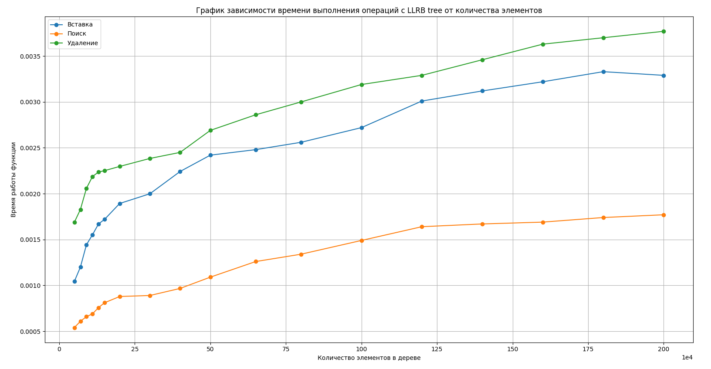

# LLRB-tree

## 📖 Описание

Этот проект представляет собой реализацию LLRB (Left-Leaning Red-Black) дерева — разновидности красно-черных деревьев, предложенной Робертом Седжвиком.  
Подробнее ознакомиться с концепцией можно в оригинальной статье Седжвика:  
[Left-Leaning Red-Black Trees (R. Sedgewick, 2008)](https://sedgewick.io/wp-content/themes/sedgewick/papers/2008LLRB.pdf)

## ⚙️ Сетап

Для более удобного визуального отображения дерева в формате `.dot` рекомендуется установить расширение 
[Graphviz Interactive Preview для Visual Studio Code](https://marketplace.visualstudio.com/items/?itemName=tintinweb.graphviz-interactive-preview)

Для проверки отсутствия утечек памяти рекомендуется использовать санитайзер `valgrind`

## 🛠️ Сборка проекта

Для сборки проекта используется `make`.

### Команда запуска:

```bash
make
```
### Запуск программы:

```bash
valgrind ./bin/lab
```

## 📊 Таймирование
Для оценки производительности были построены графики зависимости времени выполнения операций (вставка, поиск, удаление) от количества элементов в дереве.



## 📚 Документация

Подробное описание проекта можно найти в следующих документах:
- [general_task.pdf](./general_task.pdf)
- [individual_task.pdf](./individual_task.pdf)