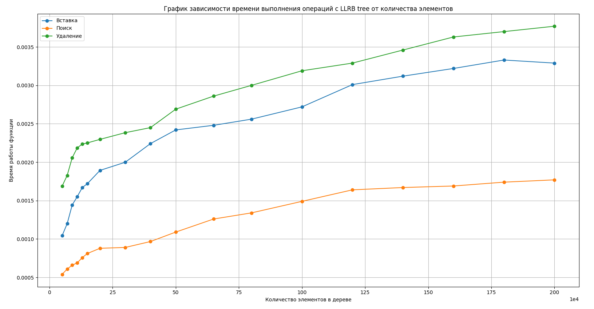
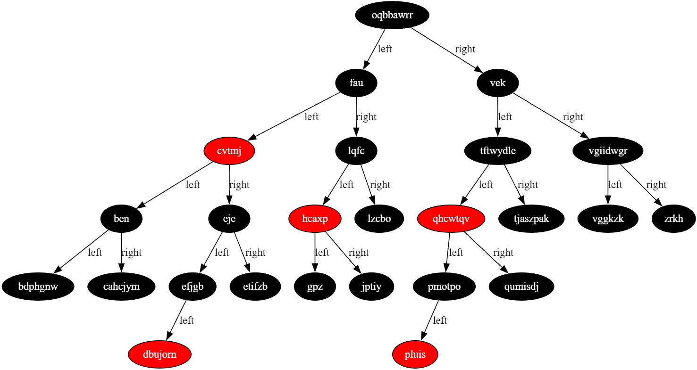

# LLRB-tree

## 📑 Содержание

- [Описание](#-описание)
- [Сетап](#-сетап)
- [Сборка проекта](#-сборка-проекта)
- [Возможности программы](#-возможности-программы)
- [Таймирование](#-таймирование)
- [Документация](#-документация)
- [Визуализация дерева](#-визуализация-дерева)

## 📖 Описание

Этот проект представляет собой реализацию LLRB (Left-Leaning Red-Black) дерева (разновидности красно-черных деревьев, предложенной Робертом Седжвиком) на языке `C`.  
Подробнее ознакомиться с концепцией можно в оригинальной статье Седжвика:  
[Left-Leaning Red-Black Trees (R. Sedgewick, 2008)](https://sedgewick.io/wp-content/themes/sedgewick/papers/2008LLRB.pdf)

## ⚙️ Сетап

Для более удобного визуального отображения дерева в формате `.dot` рекомендуется установить расширение 
[Graphviz Interactive Preview для Visual Studio Code](https://marketplace.visualstudio.com/items/?itemName=tintinweb.graphviz-interactive-preview)

Для проверки отсутствия утечек памяти рекомендуется использовать санитайзер `valgrind`

## 🛠️ Сборка проекта

Для сборки проекта используется `make`.

### Команда сборки:

```bash
make
```
### Запуск программы:

```bash
valgrind ./bin/lab
```

## 🧩 Возможности программы
Программа предоставляет следующий функционал через консольное меню:
- Добавление нового элемента
- Удаление элемента по ключу
- Обход дерева в формате Корень-Левое-Правое (КЛП)
- Форматированный вывод дерева в виде структуры
- Генерация графа дерева в формате .dot для Graphviz
- Поиск элемента по ключу
- Специальный поиск элемента по ключу
- Сохранение дерева в текстовый файл
- Загрузка дерева из текстового файла
- Генерация случайного дерева
- Вставка нескольких элементов для замера времени вставки, поиска и удаления
- Вставка нескольких элементов для замера времени специального поиска
- Считывание из файла для быстрого поиска

## 📊 Таймирование
Для оценки производительности были построены графики зависимости времени выполнения операций (вставка, поиск, удаление) от количества элементов в дереве.



## 📚 Документация

Подробное описание проекта можно найти в следующих документах:
- [general_task.pdf](./docs/general_task.pdf)
- [individual_task.pdf](./docs/individual_task.pdf)

## 🌳 Визуализация дерева

Пример визуализации построенного дерева с помощью Graphviz:



> Дерево построено на основе данных из файла `./examples/data/test.txt` и визуализировано с помощью Graphviz на основе файла `./examples/graphs/test.dot`.